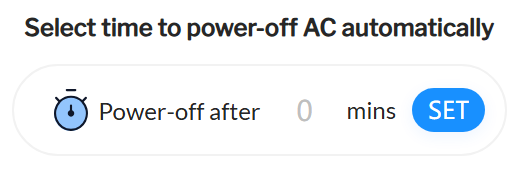

# HKUST AC Addon

This is a chrome extension for HKUST Air Conditioner System.

## Usage

You can install this extension from: (to be added). Then you will be able to see a new option:

Type the number of minutes that you want the AC to keep running, then click SET button. This will also power on the AC if it is currently off.

## Issues

The project will be actively maintained for at least one semester. That is, until 31 Dec 2025. Feel free to create an issue for bugs or new feature suggestion!